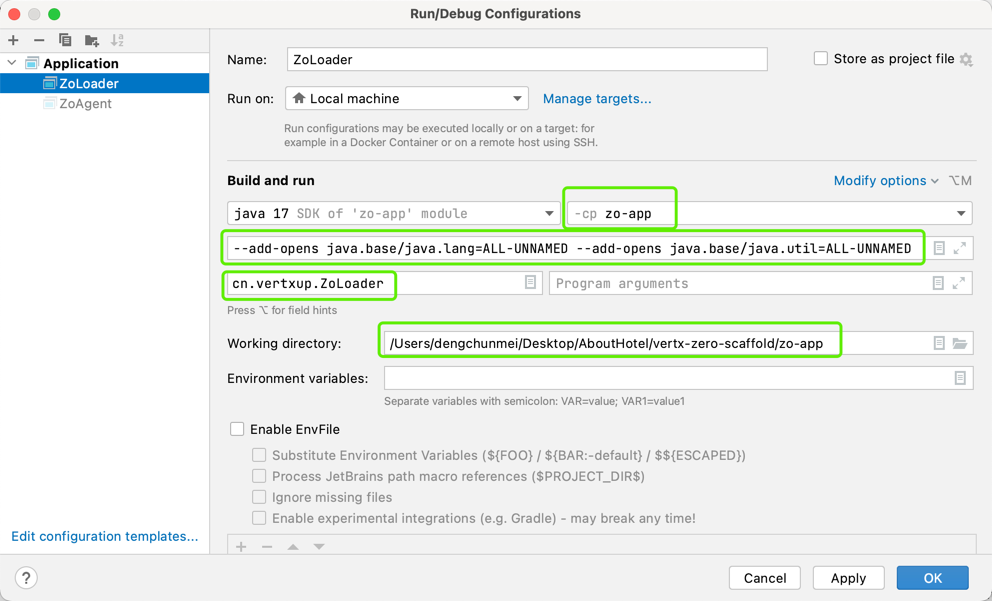

# 操作步骤

|基础项| 说明                                      |
|---|-----------------------------------------|
|前端| http://ox.server.cn:6001/zo/login/index |
|后端| http://ox.server.cn:6081                |api|

## 1. 添加host地址

```shell
# Mac, /private/etc/hosts
# Windows, C:/Windows/System32/drivers/etc/hosts
127.0.0.1     ox.server.cn
127.0.0.1     ox.engine.cn
```

## 2. 初始化后端

### 2.1. 编译Zero

由于使用了Zero的最新版，先下载编译：

```shell
git clone https://github.com/silentbalanceyh/vertx-zero
cd vertx-zero
mvn clean package install
```

### 2.2. 代码下载后编译

```shell
git clone https://github.com/silentbalanceyh/vertx-zero-scaffold
cd vertx-zero-scaffold
# ./build.sh
mvn clean package install
```

### 2.3. 数据库设置

|配置项| 说明         |
|---|------------|
|数据库| `DB_SCAFFOLD`    |
|工作流库| `DB_SCAFFOLD_WF` |
|账号| zero       |
|密码| （参考加密教程）   |
|端口| 3306       |

```shell
# 1. 进入数据库初始目录
cd zo-module/zo-commerce/script/database
#    执行脚本
./database.reinit.sh
# 执行完成后，数据库中会多出 DB_SCAFFOLD, DB_SCAFFOLD_WF 表

# 2. 进入启动器根目录
cd zo-app/
#    初始化表
./init.db.sh
# 执行完成后，数据库中 DB_SCAFFOLD 会出现数据表

# 3. 加载数据（加载界面如下图）
cn.vertxup.ZoLoader（执行类）
```



### 2.4. 启动后端（配置如上图）

**注意图中绿色方框内配置部分**

```shell
cn.vertxup.ZoAgent（执行类）
```

```shell
( Http Server ) ZeroHttpAgent Http Server has been started successfully. Endpoint: http://198.18.41.180:6085/
```